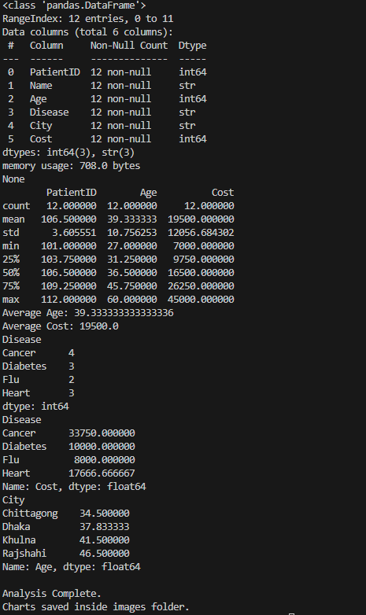
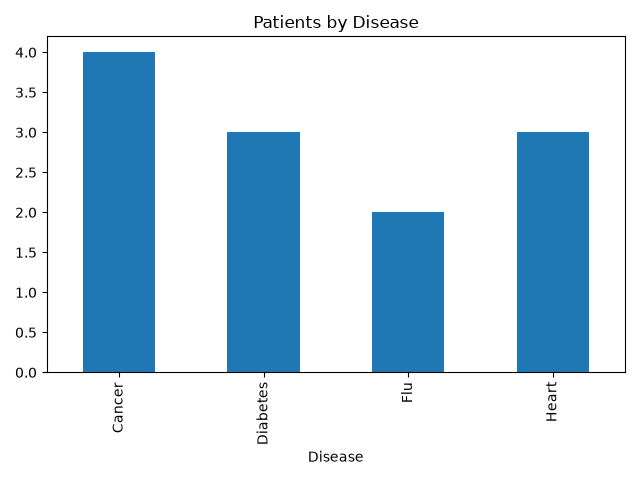
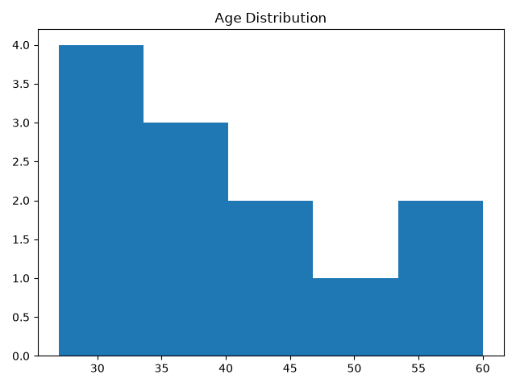
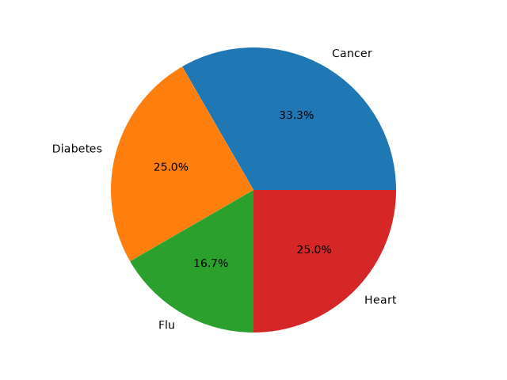
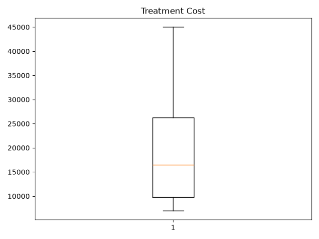

# 🏥 Hospital Patient Data Analysis

## Overview

This project analyzes hospital patient records using **Python**, **Pandas**, **NumPy**, and **Matplotlib**.

The application loads patient data from a CSV file, performs statistical analysis, and generates charts to visualize healthcare information.

---

## Features

- Load patient dataset
- Statistical analysis
- Disease-wise patient count
- Average treatment cost
- Average age by city
- Data visualization
- Object-Oriented Programming (OOP)

---

## Technologies Used

- Python
- Pandas
- NumPy
- Matplotlib
- Git

---

## Project Structure

```
Hospital-Patient-Data-Analysis/

├── data/
├── images/
├── models/
├── services/
├── main.py
├── README.md
├── requirements.txt
└── .gitignore
```

---

## Visualizations

### Terminal Output



### Patients by Disease



### Age Distribution



### Disease Distribution



### Treatment Cost



---

## How to Run

```bash
pip install -r requirements.txt
python main.py
```